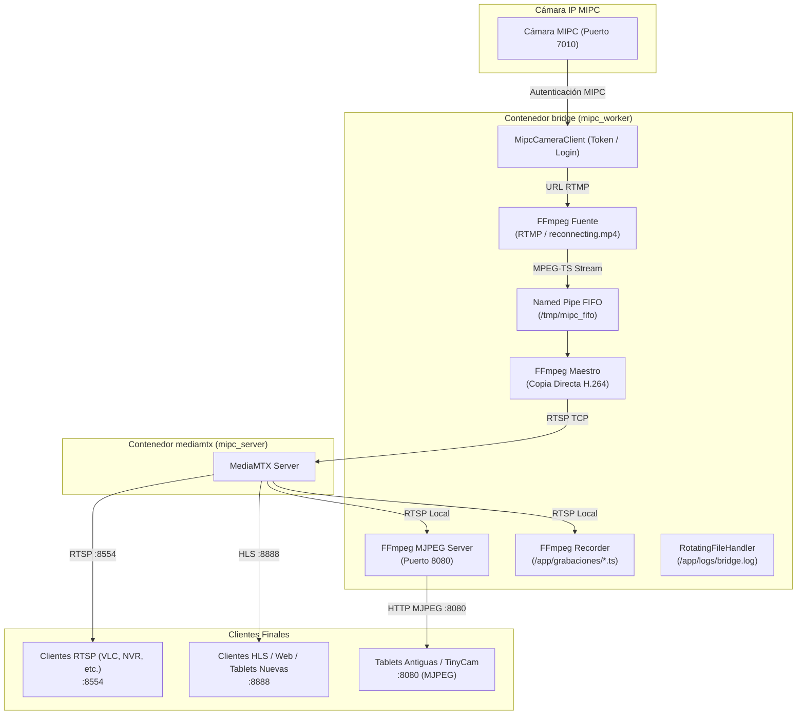

# mipc-bridge (v31.10)

`mipc-bridge` es un puente ligero y resiliente de alto rendimiento diseñado para integrar cámaras IP del ecosistema **MIPC** con un servidor de medios moderno ([MediaMTX](https://github.com/bluenviron/mediamtx)) y servir la señal de video simultáneamente a clientes modernos (RTSP/HLS) y dispositivos legacy (MJPEG sobre HTTP).

Está adaptado y optimizado para funcionar en plataformas **Raspberry Pi 4**, corriendo sobre **PXVIRT (Proxmox LXC)** o **Docker Standalone** con aceleración de hardware por GPU (VideoCore 6 / V4L2).

---

## 🛠️ Arquitectura del Sistema y Flujo de Datos



### Principales Funcionalidades:
- **Doble motor de retransmisión:**
  - **Maestro RTSP/HLS:** Transmisión de alta definición 1080p sin pérdida de calidad (copia directa H.264).
  - **Servidor MJPEG Integrado (Puerto 8080):** Servidor HTTP reentrante para clientes antiguos (como TinyCam Pro o tablets legacy).
- **Fallback Automático (Sin señal):** Cuando la cámara se desconecta o pierde la red, el sistema cambia instantáneamente a un video en bucle continuo (`assets/reconnecting.mp4`). En cuanto la cámara responde, conmuta de nuevo a la señal en vivo sin reiniciar todo el stack.
- **Grabación Continua por Segmentos:** Si se habilita `GRABAR_VIDEO=true`, graba segmentos `.ts` de duración configurable en `/app/grabaciones`.
- **Rotación y Retención Automática de Logs y Grabaciones:**
  - Archivos de log rotativos configurables por tamaño (`LOG_MAX_SIZE_MB`) y número de copias (`LOG_BACKUP_COUNT`).
  - Limpieza automática periódica de grabaciones y logs antiguos según `DIAS_RETENCION` y `LOG_RETENTION_DAYS`.

---

## 📁 Estructura del Proyecto

```
mipc-bridge/
├── .env                    # Variables de entorno con credenciales (ignorado en Git)
├── .env.example            # Plantilla de configuración con variables documentadas
├── .dockerignore           # Exclusión de contexto de build de Docker
├── .gitignore              # Filtro para control de versiones
├── Dockerfile              # Imagen Docker (Python 3.11, FFmpeg, librerías V4L2/GPU)
├── docker-compose.yml      # Definición de servicios (mediamtx y bridge)
├── assets/
│   └── reconnecting.mp4    # Video de espera cuando la cámara se desconecta
├── bridge/
│   ├── __init__.py         # Paquete Python bridge
│   ├── bridge.py           # Worker principal (gestión de streams, riconexión, retención de logs)
│   └── process_manager.py  # Gestor seguro de subprocesos FFmpeg (aislamiento por pgid)
├── config/
│   └── xorg_gpu.conf       # Configuración Xorg para GPU VideoCore 6 / DRI3
├── logs/                   # Directorio montado para logs rotativos (bridge.log)
├── recordings/             # Directorio montado para grabaciones continuas (.ts)
└── scripts/
    └── init_host.sh        # Script entrypoint (asigna permisos a nodos de GPU)
```

---

## ⚙️ Configuración (`.env`)

Copia la plantilla de ejemplo para crear tu archivo `.env`:

```bash
cp .env.example .env
```

### Tabla de Variables Configurables

| Variable | Valor por Defecto | Descripción |
| :--- | :--- | :--- |
| `CAM_IP` | **Requerido** | Dirección IP de la cámara MIPC en la red local. |
| `CAM_USER` | **Requerido** | Usuario de acceso a la cámara. |
| `CAM_PASS` | **Requerido** | Contraseña de la cámara. |
| `CAM_PORT` | `7010` | Puerto de control de la cámara MIPC. |
| `GRABAR_VIDEO` | `false` | Activa (`true`) o desactiva (`false`) la grabación continua. |
| `DIAS_RETENCION` | `7` | Días de retención para autolimpieza de grabaciones `.ts`. |
| `MINUTOS_SEGMENTO` | `15` | Duración en minutos de cada segmento de video grabado. |
| `LOG_MAX_SIZE_MB` | `5` | Tamaño máximo por archivo de log (MB) antes de rotar. |
| `LOG_BACKUP_COUNT` | `3` | Número de archivos de respaldo rotativos a conservar (`bridge.log.1`, etc.). |
| `LOG_RETENTION_DAYS`| `7` | Días de retención para eliminar logs rotados antiguos. |
| `MJPEG_RES` | `640x360` | Resolución del stream MJPEG (ej. `640x360`, `1280x720`). |
| `MJPEG_FPS` | `10` | Fotogramas por segundo para el servidor MJPEG (ej. `10`, `15`). |
| `MJPEG_QUALITY` | `8` | Calidad de compresión JPEG (Rango 2-31. Menor número = mayor calidad). |
| `MJPEG_UPDATE_INTERVAL`| `0.05` | Intervalo de refresco de envío por cliente (en segundos, ej. `0.05` = 50ms). |
| `FFMPEG_LOGLEVEL` | `error` | Nivel de verbosidad de FFmpeg para el proceso fuente y maestro. |
| `FFMPEG_MJPEG_LOGLEVEL`| `error` | Nivel de verbosidad para la emisión MJPEG. |

> ⚠️ **ADVERTENCIA DE RENDIMIENTO PARA RASPBERRY PI 4:**  
> Aumentar la resolución (ej. a `1920x1080`), incrementar los FPS (ej. a `30`) o reducir la compresión (`MJPEG_QUALITY=2`) incrementará drásticamente el consumo de CPU de la Raspberry Pi 4 y el consumo de ancho de banda de red por cada tablet o cliente conectado simultáneamente. Se recomiendan los valores por defecto (`640x360`, `10 FPS`, `Quality 8`) para mantener una excelente fluidez sin saturar el sistema.

---

## 🚀 Despliegue con Docker Compose

Desde la raíz del proyecto, ejecuta:

```bash
docker compose up -d --build
```

### Verificación de Estado y Logs:

```bash
# Ver logs en tiempo real del worker
docker compose logs -f bridge

# Ver contenido del archivo de logs con rotación en el host
tail -f logs/bridge.log
```

---

## 🔍 Diagnóstico y Pruebas Rápidas

Si deseas probar la conexión directa con la cámara y verificar el stream RTMP devuelto por `mipc-camera-client-python`:

```bash
docker compose exec -T bridge python3 -c "
import os
from mipc_camera_client import MipcCameraClient
c = MipcCameraClient(os.getenv('CAM_IP'))
c.login(os.getenv('CAM_USER'), os.getenv('CAM_PASS'))
print('RTMP Stream URL:', c.get_rtmp_stream())
"
```

---

## 🔒 Créditos y Licencia

* **Librería MIPC:** Integración de protocolo MIPC basada en [mipc-camera-client-python](https://github.com/pan-maruda/mipc-camera-client-python) de `pan-maruda`.
* **Licencia:** MIT License (Ver [LICENSE](file:///opt/mipc-bridge/LICENSE)).
