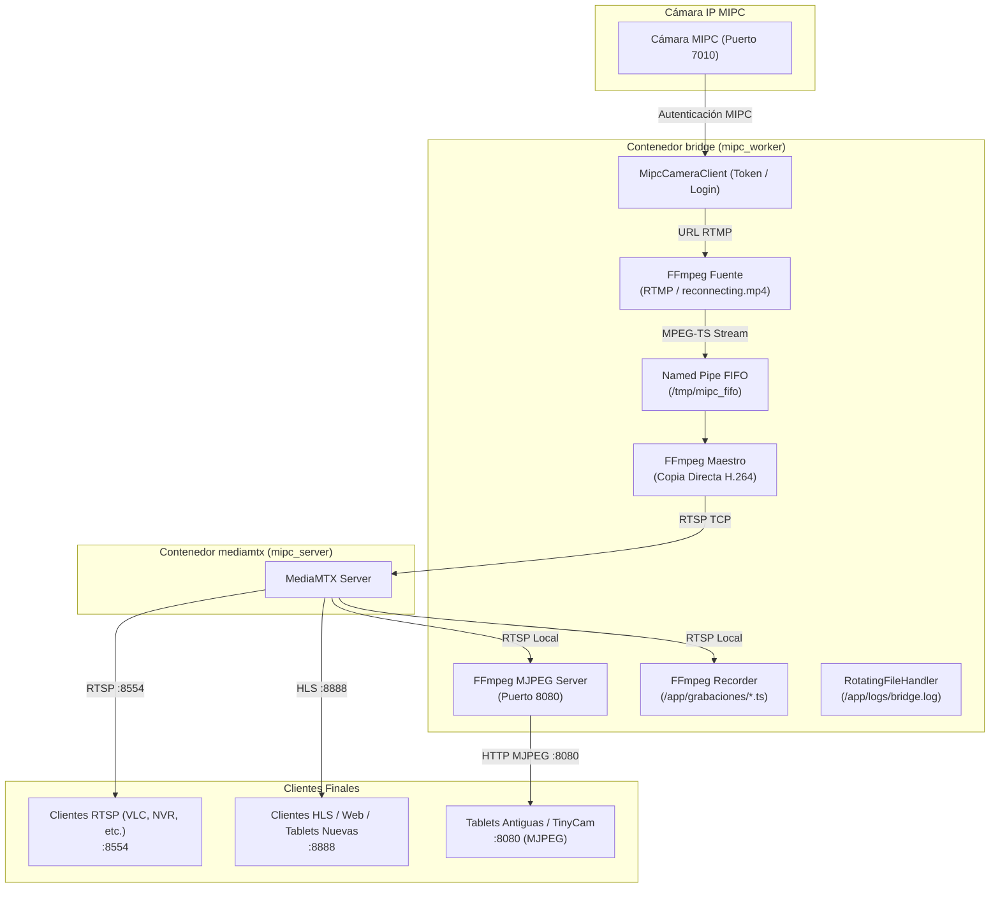

# mipc-bridge (v31.10)

`mipc-bridge` es un puente ligero y resiliente de alto rendimiento diseñado para integrar cámaras IP del ecosistema **MIPC** con un servidor de medios moderno ([MediaMTX](https://github.com/bluenviron/mediamtx)) y servir la señal de video simultáneamente a clientes modernos (RTSP/HLS) y dispositivos legacy (MJPEG sobre HTTP).

Está adaptado y optimizado para funcionar en plataformas **Raspberry Pi 4**, corriendo sobre **PXVIRT (Proxmox LXC)** o **Docker Standalone** con aceleración de hardware por GPU (VideoCore 6 / V4L2).

---

## 🛠️ Arquitectura del Sistema y Flujo de Datos



### Principales Funcionalidades:
- **Doble motor de retransmisión:**
  - **Maestro RTSP/HLS:** Transmisión de alta definición 1080p (copia directa H.264) con canal de audio AAC integrado.
  - **Servidor MJPEG Integrado (Puerto 8080):** Servidor HTTP reentrante para clientes antiguos (como TinyCam Pro o tablets legacy).
- **Audio Integrado (RTSP y HLS):** Transmisión simultánea de video y audio AAC (16 kHz) sobre RTSP (`:8554`) y HLS (`:8888`) a consumo de CPU ínfimo (<0.5%).
- **Fallback Automático (Sin señal):** Cuando la cámara se desconecta o pierde la red, el sistema cambia instantáneamente a un video en bucle continuo (`assets/reconnecting.mp4`). En cuanto la cámara responde, conmuta de nuevo a la señal en vivo sin reiniciar todo el stack.
- **Grabación Continua por Segmentos:** Si se habilita `GRABAR_VIDEO=true`, graba segmentos `.ts` de duración configurable en `/app/grabaciones`.
- **Rotación y Retención Automática de Logs y Grabaciones:**
  - Archivos de log rotativos configurables por tamaño (`LOG_MAX_SIZE_MB`) y número de copias (`LOG_BACKUP_COUNT`).
  - Limpieza automática periódica de grabaciones y logs antiguos según `DIAS_RETENCION` y `LOG_RETENTION_DAYS`.

---

## 📁 Estructura del Proyecto

```
mipc-bridge/
├── .env                    # Variables de entorno con credenciales (ignorado en Git)
├── .env.example            # Plantilla de configuración con variables documentadas
├── .dockerignore           # Exclusión de contexto de build de Docker
├── .gitignore              # Filtro para control de versiones
├── Dockerfile              # Imagen Docker (Python 3.11, FFmpeg, librerías V4L2/GPU)
├── docker-compose.yml      # Definición de servicios (mediamtx y bridge)
├── assets/
│   └── reconnecting.mp4    # Video de espera cuando la cámara se desconecta
├── bridge/
│   ├── __init__.py         # Paquete Python bridge
│   ├── bridge.py           # Worker principal (gestión de streams, riconexión, retención de logs)
│   └── process_manager.py  # Gestor seguro de subprocesos FFmpeg (aislamiento por pgid)
├── config/
│   └── xorg_gpu.conf       # Configuración Xorg para GPU VideoCore 6 / DRI3
├── logs/                   # Directorio montado para logs rotativos (bridge.log)
├── recordings/             # Directorio montado para grabaciones continuas (.ts)
└── scripts/
    └── init_host.sh        # Script entrypoint (asigna permisos a nodos de GPU)
```

---

## ⚙️ Configuración (`.env`)

Copia la plantilla de ejemplo para crear tu archivo `.env`:

```bash
cp .env.example .env
```

### Tabla de Variables Configurables

| Variable | Valor por Defecto | Descripción |
| :--- | :--- | :--- |
| `CAM_IP` | **Requerido** | Dirección IP de la cámara MIPC en la red local. |
| `CAM_USER` | **Requerido** | Usuario de acceso a la cámara. |
| `CAM_PASS` | **Requerido** | Contraseña de la cámara. |
| `CAM_PORT` | `7010` | Puerto de control de la cámara MIPC. |
| `ENABLE_AUDIO` | `true` | Activa (`true`) o desactiva (`false`) el canal de audio en RTSP y HLS. |
| `GRABAR_VIDEO` | `false` | Activa (`true`) o desactiva (`false`) la grabación continua. |
| `DIAS_RETENCION` | `7` | Días de retención para autolimpieza de grabaciones `.ts`. |
| `MINUTOS_SEGMENTO` | `15` | Duración en minutos de cada segmento de video grabado. |
| `LOG_MAX_SIZE_MB` | `5` | Tamaño máximo por archivo de log (MB) antes de rotar. |
| `LOG_BACKUP_COUNT` | `3` | Número de archivos de respaldo rotativos a conservar (`bridge.log.1`, etc.). |
| `LOG_RETENTION_DAYS`| `7` | Días de retención para eliminar logs rotados antiguos. |
| `MJPEG_RES` | `640x360` | Resolución del stream MJPEG (ej. `640x360`, `1024x576`, o `native`). |
| `MJPEG_FPS` | `2` | Fotogramas por segundo del servidor MJPEG (ej. `2` a `5`). |
| `MJPEG_QUALITY` | `8` | Calidad de compresión JPEG (Rango 2-31; `8` a `12` = balance óptimo). |
| `HLS_SEGMENT_DURATION` | `2s` | Duración de segmentos HLS (2s-3s para evitar parpadeos de carga en navegador). |
| `HLS_PART_DURATION` | `500ms` | Duración de micro-partes HLS. |
| `FFMPEG_LOGLEVEL` | `error` | Nivel de verbosidad de FFmpeg para el proceso fuente y maestro. |
| `FFMPEG_MJPEG_LOGLEVEL`| `error` | Nivel de verbosidad para la emisión MJPEG. |

> ⚠️ **ANÁLISIS DE RENDIMIENTO Y OPTIMIZACIÓN DE CPU (RASPBERRY PI 4):**  
> - **Generación On-Demand (0% CPU en Reposo):** Cuando no hay clientes visualizando la señal en el puerto `8080`, el generador MJPEG apaga automáticamente el subproceso FFmpeg tras 5 segundos de inactividad, liberando por completo la CPU (**0.0% consumo**).
> - **Desempeño según Resolución y FPS:**
>   - **`640x360` a 2 FPS:** Consumo ultra bajo de solo **~18-20% de 1 núcleo** (~5% del procesador total de la Raspberry Pi 4).
>   - **`1024x576` a 2 FPS:** Ajuste perfecto para tablets 16:9 sin deformación con consumo moderado (**~40% de 1 núcleo / 10% total**).
>   - **`native` (1080p):** Procesar 2.07 Megapíxeles por imagen mediante cuantización de bloques en software incrementa el uso de CPU a **90% - 150% de 1 núcleo**. Se recomienda mantener `640x360` o `1024x576`.
> - **Compresión JPEG (`MJPEG_QUALITY=8`):** Mantener la calidad en 8 produce archivos por foto livianos (~25 KB). Reducir la cuantización a valores como `2` incrementa el peso a 250 KB+ por trama, aumentando el consumo de CPU por sobrecarga de memoria e I/O de red.

---

## 🖥️ Mapeo de Dispositivos GPU y Códecs en Raspberry Pi 4 (Proxmox LXC / Docker)

### 1. Dispositivos de Aceleración por Hardware (Broadcom BCM2711 / VideoCore 6)
Para que el contenedor tenga acceso directo a la GPU y a los decodificadores/codificadores por hardware V4L2 M2M en la Raspberry Pi 4, `docker-compose.yml` mapea los siguientes nodos:

- `/dev/video10`, `/dev/video11`, `/dev/video12`: Decodificadores y codificadores de video por hardware V4L2 M2M (`bcm2835-codec`).
- `/dev/dri`: Nodos de renderizado DRM/KMS para aceleración por GPU VideoCore VI (`card1`, `renderD128`).
- `/dev/vcsm-cma`: Asignador de memoria compartida continua (CMA / Contiguous Memory Allocator) entre la CPU y la GPU.
- `/dev/vchiq`: Interfaz de comandos del firmware VideoCore de Broadcom.
- `/dev/fb0`: Framebuffer del sistema.

#### Mapeo necesario para Proxmox LXC (`/etc/pve/lxc/<ID>.conf`):
Si ejecutas Docker dentro de un contenedor LXC en Proxmox VE, agrega estas líneas al archivo de configuración del LXC:

```ini
# Aceleración por GPU y V4L2 M2M (Raspberry Pi 4)
lxc.cgroup2.devices.allow: c 226:* rwm
lxc.cgroup2.devices.allow: c 239:* rwm
lxc.cgroup2.devices.allow: c 81:* rwm
lxc.mount.entry: /dev/dri dev/dri none bind,optional,create=dir
lxc.mount.entry: /dev/vchiq dev/vchiq none bind,optional,create=file
lxc.mount.entry: /dev/vcsm-cma dev/vcsm-cma none bind,optional,create=file
lxc.mount.entry: /dev/video10 dev/video10 none bind,optional,create=file
lxc.mount.entry: /dev/video11 dev/video11 none bind,optional,create=file
lxc.mount.entry: /dev/video12 dev/video12 none bind,optional,create=file
lxc.mount.entry: /dev/fb0 dev/fb0 none bind,optional,create=file
```

---

### 2. Códecs y Formatos de Copia Utilizados por FFmpeg

- **Stream Maestro H.264 (RTSP / HLS / Grabaciones)**:
  - **Códec de Video**: Copia Directa (`-c:v copy`) sin re-codificación en CPU. Consumo de CPU **~0.1%**.
  - **Bitstream Filter**: `-bsf:v h264_mp4toannexb,dump_extra=keyframe` para re-empaquetar tramas H.264 al formato Annex-B asegurando encabezados SPS/PPS antes de cada I-frame (Keyframe).
  - **Códec de Audio**: Recodificación ligera a AAC (`-c:a aac -b:a 64k`) o copia directa (`-c:a copy`) según la opción `ENABLE_AUDIO`.

- **Servidor MJPEG HTTP (Puerto 8080 - Legacy)**:
  - **Decodificador por Hardware (GPU)**: `-c:v h264_v4l2m2m` (utiliza el decodificador H.264 por hardware Broadcom V4L2 de la Raspberry Pi 4).
  - **Codificador MJPEG y DCT**: `-c:v mjpeg -dct fastint -q:v {quality}` con algoritmo de DCT rápido entero para mantener el consumo de CPU a solo **~12% de 1 solo núcleo**.

---

## 🚀 Despliegue con Docker Compose

Desde la raíz del proyecto, ejecuta:

```bash
docker compose up -d --build
```

### Verificación de Estado y Logs:

```bash
# Ver logs en tiempo real del worker
docker compose logs -f bridge

# Ver contenido del archivo de logs con rotación en el host
tail -f logs/bridge.log
```

---

## 🔍 Diagnóstico y Pruebas Rápidas

Si deseas probar la conexión directa con la cámara y verificar el stream RTMP devuelto por `mipc-camera-client-python`:

```bash
docker compose exec -T bridge python3 -c "
import os
from mipc_camera_client import MipcCameraClient
c = MipcCameraClient(os.getenv('CAM_IP'))
c.login(os.getenv('CAM_USER'), os.getenv('CAM_PASS'))
print('RTMP Stream URL:', c.get_rtmp_stream())
"
```

---

## 🔒 Créditos y Licencia

* **Librería MIPC:** Integración de protocolo MIPC basada en [mipc-camera-client-python](https://github.com/pan-maruda/mipc-camera-client-python) por `Pan Maruda` (Licencia BSD 3-Clause).
* **Licencia del Proyecto:** MIT License para `mipc-bridge` (Ver [LICENSE](file:///opt/mipc-bridge/LICENSE) para el texto completo y licencias de terceros).
